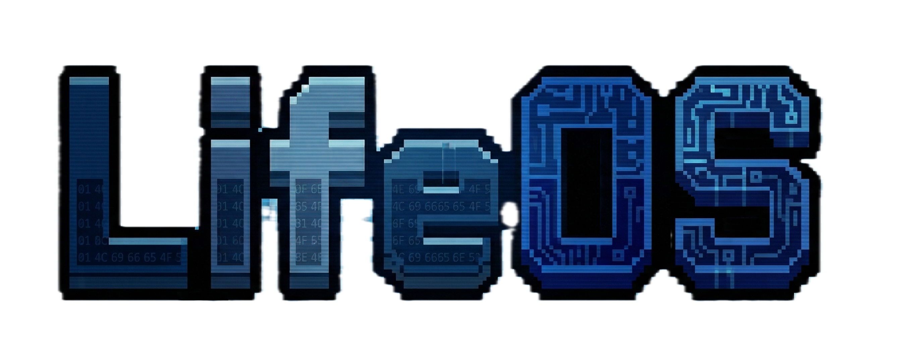

# LifeOS

[中文](./README.md) | [English](./README.en.md)

LifeOS helps you grow scattered ideas into structured knowledge and truly master it, from quick captures, to brainstorming and deep research, to systematic project planning and knowledge notes, to spaced review and mastery tracking. The goal is not just building a knowledge base, but helping you understand, internalize, and command complex knowledge.

## Why Build LifeOS?

LifeOS started from a simple goal: package learning workflows, skills, templates, prompts, and a memory system into one complete setup you can use immediately. Instead of assembling your own toolchain from scratch or jumping between disconnected tools, you can initialize once, start working right away, and keep accumulating knowledge, process, and preferences as you go.

## Core Features

### Memory System

> The memory system is LifeOS's core capability. It works in a directory-scoped, skill-bound way, continuously preserving the context, preferences, and decisions that emerge during learning so long-term learning becomes more continuous, more traceable, and easier to build on.

#### Cross-session continuity

Session bridges and active-document context persist, so agents do not depend only on the current conversation.

#### Project-scoped and skill-bound

The memory system runs around the current LifeOS project in the vault, activates only inside workflows such as `today`, `project`, `research`, `knowledge`, `revise`, `digest`, and `archive`, and keeps accumulating preferences, decisions, and context.

#### More controllable than global memory

Compared with a memory model that mixes cross-directory content and global conversations together, a project-scoped, skill-bound memory system reduces irrelevant noise and keeps retrieval and follow-up decisions closer to the current LifeOS workflow.

### Directory Customization

LifeOS does not lock you into fixed directory names. Run `lifeos rename [path]` and the CLI will interactively list the directories that can be adjusted in the current vault, then guide you through choosing one and entering a new name.

It updates `lifeos.yaml`, renames the actual directory, and batch-replaces all related wikilinks across the vault. That lets you adapt directory names to your own workflow, language preference, and project structure while keeping configuration and links consistent.

### Learning Workflows

LifeOS provides a set of Agent skills designed around the learning process, connecting "input -> understanding -> output -> reinforcement" into a continuous workflow:

- `/today`, `/brainstorm`, `/ask`: organize the day's focus, clarify questions, and quickly expand ideas
- `/project`, `/research`, `/knowledge`: turn a topic into a project, a research report, and structured knowledge notes
- `/digest`: subscribe to topic updates and generate structured weekly digests from paper sources, RSS, and web search
- `/read-pdf`, `/revise`, `/archive`: move from source extraction, to review and reinforcement, to periodic archiving

## Core Components

- **Memory system** — Project-scoped and skill-bound, providing vault indexing, session memory, and context assembly for AI agents
- **CLI scaffold** — install globally, then use `lifeos init` to bootstrap a complete workspace
- **Skill system** — 10 Agent skills covering daily planning, projects, research, weekly digests, knowledge curation, review, and more
- **Templates + Schema** — 8 structured templates + Frontmatter schema for consistent notes

## Quick Start

LifeOS has been verified to work properly with Claude Code TUI / Codex TUI / OpenCode TUI on macOS, and with OpenCode GUI on Windows. Other desktop GUI apps or platform/client combinations have not been validated yet and may require additional testing.

### Prerequisites

Before starting, make sure Obsidian and at least one of Claude Code TUI / Codex TUI / OpenCode TUI / OpenCode GUI are installed locally.

| Dependency | Required | Purpose |
|---|---|---|
| **Node.js 24.14.1+ (LTS)** | Required | Runtime for MCP server and CLI |
| **Python 3** | Required | PDF extraction (`/read-pdf`) and digest fetch helpers (`/digest`) |

`lifeos init` checks all prerequisites before creating the workspace.

### Installation and Initialization

```bash
# Step 1: install the CLI globally
npm install -g lifeos

# Step 2: create a new LifeOS workspace (auto-detects language from system locale)
lifeos init ./my-vault

# Or specify language explicitly
lifeos init ./my-vault --lang zh   # Chinese
lifeos init ./my-vault --lang en   # English
```

After init, MCP server configs are automatically registered for:

| Tool | Config file |
|---|---|
| **Claude Code** | `.mcp.json` |
| **Codex** | `.codex/config.toml` |
| **OpenCode** | `opencode.json` |

Launch any of these tools in the vault directory to use all skills.

If you want version control for the vault, initialize and manage Git yourself. LifeOS does not create or manage Git metadata for you.

## CLI Commands

```bash
lifeos init [path] [--lang zh|en] [--no-mcp]           # Create a new vault
lifeos upgrade [path] [--lang zh|en] [--override]      # Upgrade and restore assets/scaffold
lifeos doctor [path]                                   # Health check
lifeos rename [path]                                   # Interactive directory rename
lifeos --help                                          # Show help
lifeos --version                                       # Show version
```

### init

Creates a complete LifeOS workspace:

- 10 top-level directories plus nested subdirectories
- 8 Markdown templates
- Frontmatter schema
- 10 AI skills with language-aware assets
- `CLAUDE.md` agent behavior spec
- `lifeos.yaml` config
- MCP server registration (Claude Code / Codex / OpenCode)

### upgrade

Upgrades and re-syncs an initialized vault:

- **Smart merge**: update unmodified templates, schema files, built-in prompts, and skill files; skip modified ones with a warning
- **Restore missing scaffold**: bring back missing directories and managed files such as the memory directory, `.claude/skills`, `CLAUDE.md`, `AGENTS.md`, and MCP config entries
- **Preserve user changes**: built-in files already customized by the user are not force-overwritten
- **`--override` force-refreshes resources**: overwrite templates, schema, prompts, skills, `CLAUDE.md`, `AGENTS.md`, and MCP config entries without deleting user notes, resources, `memory.db`, memory-system data, or custom directory/memory settings in `lifeos.yaml`

By default, `lifeos upgrade` tries to preserve resource files you have already modified, while updating untouched content and restoring anything missing. If you want to explicitly replace those resources with the current built-in templates, skills, schema files, and MCP config entries, use `--override`:

```bash
lifeos upgrade ./my-vault --override
```

### doctor

Checks vault integrity: directory structure, templates, schema, skills, config, Node.js version, and asset version.

### rename: Directory Customization

No extra flags are required. Run `lifeos rename [path]` and the CLI will show the directories available in the current vault, then guide you step by step to choose one and enter a new name. It updates `lifeos.yaml`, renames the actual directory, and batch-replaces related wikilinks across the vault.

This means LifeOS does not lock you into fixed directory names. You can freely adapt directory names to your own workflow, language preference, and project structure while keeping configuration and links consistent.

## Skills

| Skill | Description |
|---|---|
| `/today` | Morning planning: review yesterday, plan today |
| `/project` | Idea -> structured project |
| `/research` | Topic -> deep research report |
| `/digest` | Topic subscription -> structured weekly digest |
| `/knowledge` | Book/paper -> knowledge note |
| `/revise` | Generate quizzes, grade, and track mastery |
| `/read-pdf` | PDF -> structured notes |
| `/ask` | Quick Q&A |
| `/brainstorm` | Interactive brainstorming |
| `/archive` | Archive completed projects, processed drafts, completed plans, and diary entries older than the most recent 7 days |

## Custom Expert Prompts

The `/research` skill automatically scans the Prompts directory in your vault for expert prompt files. LifeOS ships with built-in expert prompts for AI/LLM, Math, Art, and History, and you can add your own to extend research capabilities to any domain.

### How It Works

When you invoke `/research`, the Planning Agent:

1. Lists all `.md` files in `{system directory}/Prompts/`
2. Reads each file's frontmatter and **Domain Coverage** section
3. Matches the research topic to the best-fit expert prompt
4. Applies the matched prompt's analytical framework and output format to the research report

### Adding Custom Expert Prompts

Create a `.md` file in your vault's Prompts directory (`{system directory}/Prompts/`). The Planning Agent will pick it up automatically on the next `/research` invocation, with no restart or re-init required. Use the built-in prompts in the same directory as a reference for structure.

## Tech Stack

- **Runtime:** TypeScript + Node.js 24.14.1+ (LTS)
- **Database:** SQLite + FTS5 (full-text search)
- **Segmentation:** @node-rs/jieba (Chinese tokenization)
- **Protocol:** MCP (Model Context Protocol)
- **Vault:** Obsidian (plain Markdown + Frontmatter)

## Milestones

- ✅ LifeOS 1.0 is now basically usable
- ✅ The CLI supports directory customization
- ✅ The CLI `upgrade` command supports smart updates
- ✅ Claude Code TUI / Codex TUI / OpenCode TUI on macOS and OpenCode GUI on Windows have been tested
- ✅ The `/digest` skill supports multilingual weekly digests with multi-source paper fetching
- ☐ Improve memory-system precision
- ☐ Support custom skills
- ☐ Support custom workflows

## Development

```bash
git clone git@github.com:luneth90/lifeos.git
cd lifeos
npm install
npm run build    # Compile TypeScript
npm test         # Run tests (431 tests)
npm run dev      # Dev mode (hot reload)
```

## License

[MIT](LICENSE)

## Acknowledgements

This project was inspired by [MarsWang42/OrbitOS](https://github.com/MarsWang42/OrbitOS). 
