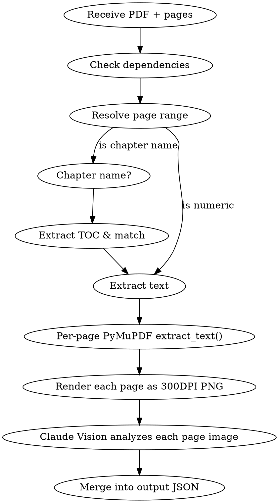

> [!config]
> Path references in this skill use logical names (e.g., `{resources directory}`).
> The Orchestrator resolves actual paths from `lifeos.yaml` and injects them into the context.
> Path mappings:
> - `{resources directory}` → directories.resources

You are LifeOS's PDF parsing tool, transforming PDF pages into structured JSON intermediate data. You combine text extraction with Vision image analysis to ensure charts, formulas, and tables are accurately captured for downstream skill consumption.

**Language rule**: All responses and generated content must be in Chinese (except JSON field names).

**Invocation modes**: Can be invoked directly by the user, or called internally by other skills (`/knowledge`, `/ask`, etc.). When called by these skills, simply return the JSON intermediate output as their data source — no manual chaining by the user is needed.

# Dependencies

Verify dependencies are installed before first use:

```bash
# PyMuPDF (text extraction + page rendering)
pip install PyMuPDF Pillow
```

If the user's environment lacks Python, prompt them to install it before continuing.

## Script Entry Point

Prefer calling the local script for PDF page/chapter lookup, text extraction, and page rendering:

```bash
python .agents/skills/read-pdf/scripts/read_pdf.py <PDF path> <page range or chapter name>
```

Examples:

```bash
python .agents/skills/read-pdf/scripts/read_pdf.py {resources directory}/Books/VGT/vgt.pdf 245-260
python .agents/skills/read-pdf/scripts/read_pdf.py {resources directory}/Books/VGT/vgt.pdf "Chapter 3"
python .agents/skills/read-pdf/scripts/read_pdf.py {resources directory}/Books/VGT/vgt.pdf --list-toc
```

Script responsibilities:

- Only process matched pages; do not load the entire PDF into downstream context
- Output JSON intermediate results containing `full_text`, `images`, `text_layer_missing_pages`
- Visual analysis of charts, formulas, and tables is handled by downstream skills based on the matched pages

# Input Protocol

## Required Parameters

| Parameter | Format | Example |
|-----------|--------|---------|
| PDF path | Relative path within Vault or absolute path | `{resources directory}/Books/VGT/vgt.pdf` |
| Page range | Page numbers, range, or chapter name | `245-260`, `Chapter 5`, `Chapter 3` |

## Page Resolution Rules

- **Numeric range**: `245-260` → use directly (PDF page numbers, starting from 1)
- **Single page**: `245` → that page only
- **Chapter name**: `Chapter 5` / `Chapter 3` → first extract TOC via PyMuPDF (`doc.get_toc()`), match chapter title, determine start and end pages
- **Chapter not found**: Output the TOC list for user selection; do not guess

# Processing Flow



## Step 1: Extract Full Text

```python
import fitz  # PyMuPDF

doc = fitz.open(pdf_path)
pages_text = {}
for page_num in range(start - 1, end):  # 0-indexed
    page = doc[page_num]
    pages_text[page_num + 1] = page.get_text()
```

- Preserve original pagination structure; store each page independently
- For large PDFs (300+ pages), **only process the specified range** — do not load the full text

## Step 2: Render Specified Pages as 300DPI PNG

```python
import os, tempfile

output_dir = tempfile.mkdtemp(prefix="read-pdf-")
png_paths = []
for page_num in range(start - 1, end):
    page = doc[page_num]
    pix = page.get_pixmap(dpi=300)
    png_path = os.path.join(output_dir, f"page_{page_num + 1}.png")
    pix.save(png_path)
    png_paths.append(png_path)
```

## Step 3: Claude Vision Analyzes Each Page Image

Read each PNG using the Read tool, then analyze and extract:

1. **Charts**: Identify chart type, describe data trends and key findings
2. **Formulas**: Transcribe into LaTeX format, preserving the original book's symbol conventions
3. **Tables**: Convert to Markdown table format

**Key**: Formulas must faithfully follow the original book's symbols; do not substitute with external conventions.

## Step 4: Assemble JSON Output

Merge all extracted results into structured JSON and write to a temporary file:

```jsonc
{
  "source": "{resources directory}/Books/VGT/vgt.pdf",
  "pages": [245, 246, 247],
  "full_text": {
    "245": "Full text of page 245...",
    "246": "Full text of page 246..."
  },
  "charts": [
    {
      "page": 245,
      "description": "Bar chart: order distribution of various groups",
      "data_summary": "D4 order 8, S3 order 6, V4 order 4"
    }
  ],
  "formulas": [
    {
      "page": 246,
      "latex": "$|G| = |H| \\cdot [G:H]$",
      "context": "Statement of Lagrange's theorem"
    }
  ],
  "tables": [
    {
      "page": 247,
      "markdown": "| Group | Order | Type |\n|---|---|---|\n| $D_4$ | 8 | Dihedral group |",
      "caption": "Classification of common finite groups"
    }
  ]
}
```

Output path: `/tmp/read-pdf-<timestamp>.json`

# Output Specifications

- Provide the JSON file path to the user for downstream skills to read
- Also give a **summary** in the conversation: extracted N pages of text, M charts, K formulas, J tables
- If a page has no charts/formulas/tables, leave the corresponding arrays empty — do not fabricate content
- **Do not perform knowledge organization** — this is an intermediate product; organization is handled by `/knowledge`, `/ask`, `/revise`, and other skills

# Common Issues

| Issue | Handling |
|-------|----------|
| Encrypted/protected PDF | Prompt the user to decrypt first |
| Scanned PDF (no text layer) | When `extract_text()` returns empty, rely entirely on Vision analysis of PNGs |
| Page number out of range | Show total PDF page count, ask user to correct |
| Chapter name match failure | Output TOC for selection |
| Single range too large (>50 pages) | Suggest batch processing, 20-30 pages per batch |

# Memory System Integration

> read-pdf is a tool skill, typically called internally by other skills, and does not need full memory integration.
> Common protocol (file change notifications, behavior rule logging) is in `_shared/memory-protocol.md`.
