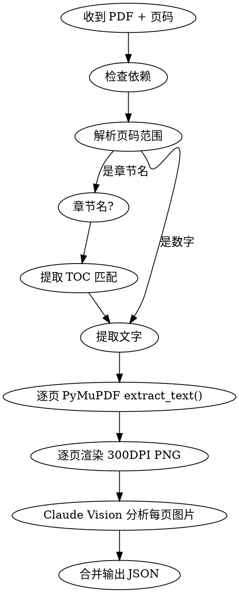

> [!config] 路径配置
> 执行本技能前，先读取 Vault 根目录的 `lifeos.yaml`，获取以下路径映射：
> - `directories.resources` → 资源目录
>
> 后续所有路径操作使用配置值，不使用硬编码路径。

你是 LifeOS 的 PDF 中间读取器。将 PDF 指定页码范围提取为结构化 JSON 中间成果，供 `/knowledge`、`/review`、`/ask` 等下游技能消费。

**语言规则**：所有回复和生成内容必须为中文（JSON 字段名除外）。

**调用方式**：可由用户直接调用，也可被其他技能（`/knowledge`、`/ask` 等）内部调用。被这些技能调用时，只需返回 JSON 中间成果供，作为这些技能的数据源，不需要用户再手动串联。

# 依赖

首次使用前确认依赖已安装：

```bash
# PyMuPDF（文字提取 + 页面渲染）
pip install PyMuPDF Pillow
```

若用户环境无 Python，提示安装后再继续。

## 脚本入口

优先调用本地脚本完成 PDF 的页码/章节定位、文字提取、页面渲染：

```bash
python3 .agents/skills/read-pdf/scripts/read_pdf.py <PDF路径> <页码范围或章节名>
```

示例：

```bash
python3 .agents/skills/read-pdf/scripts/read_pdf.py {资源目录}/Books/VGT/vgt.pdf 245-260
python3 .agents/skills/read-pdf/scripts/read_pdf.py {资源目录}/Books/VGT/vgt.pdf "第3章"
python3 .agents/skills/read-pdf/scripts/read_pdf.py {资源目录}/Books/VGT/vgt.pdf --list-toc
```

脚本职责：

- 只处理命中的页，不加载整本 PDF 到下游上下文
- 输出 JSON 中间结果，包含 `full_text`、`images`、`text_layer_missing_pages`
- 图表、公式、表格的视觉分析由下游技能基于这些命中页继续完成

# 输入协议

## 必须参数

| 参数 | 格式 | 示例 |
|------|------|------|
| PDF 路径 | Vault 内相对路径或绝对路径 | `{资源目录}/Books/VGT/vgt.pdf` |
| 页码范围 | 页码、范围、或章节名 | `245-260`、`Chapter 5`、`第3章` |

## 页码解析规则

- **数字范围**：`245-260` → 直接使用（PDF 页码，从 1 开始）
- **单页**：`245` → 仅该页
- **章节名**：`Chapter 5` / `第3章` → 先用 PyMuPDF 提取 TOC（`doc.get_toc()`），匹配章节标题，确定起止页码
- **未找到章节**：输出 TOC 列表供用户选择，不猜测

# 处理流程



## 步骤一：提取完整文字

```python
import fitz  # PyMuPDF

doc = fitz.open(pdf_path)
pages_text = {}
for page_num in range(start - 1, end):  # 0-indexed
    page = doc[page_num]
    pages_text[page_num + 1] = page.get_text()
```

- 保留原始分页结构，每页独立存储
- 对于 300+ 页大 PDF，**只处理指定范围**，不加载全文

## 步骤二：渲染指定页为 300DPI PNG

```python
import os, tempfile

output_dir = tempfile.mkdtemp(prefix="read-pdf-")
png_paths = []
for page_num in range(start - 1, end):
    page = doc[page_num]
    pix = page.get_pixmap(dpi=300)
    png_path = os.path.join(output_dir, f"page_{page_num + 1}.png")
    pix.save(png_path)
    png_paths.append(png_path)
```

## 步骤三：Claude Vision 分析每页图片

对每张 PNG 使用 Read 工具读取图片，然后分析提取：

1. **图表（charts）**：识别图表类型、描述数据趋势和关键发现
2. **公式（formulas）**：转写为 LaTeX 格式，保留原书符号约定
3. **表格（tables）**：转为 Markdown 表格格式

**关键**：公式必须忠实于原书符号，不用外部约定替换。

## 步骤四：组装 JSON 输出

将所有提取结果合并为结构化 JSON，写入临时文件：

```jsonc
{
  "source": "{资源目录}/Books/VGT/vgt.pdf",
  "pages": [245, 246, 247],
  "full_text": {
    "245": "第245页的完整文字...",
    "246": "第246页的完整文字..."
  },
  "charts": [
    {
      "page": 245,
      "description": "柱状图：各群的阶数分布",
      "data_summary": "D4 阶数8，S3 阶数6，V4 阶数4"
    }
  ],
  "formulas": [
    {
      "page": 246,
      "latex": "$|G| = |H| \\cdot [G:H]$",
      "context": "拉格朗日定理的表述"
    }
  ],
  "tables": [
    {
      "page": 247,
      "markdown": "| 群 | 阶 | 类型 |\n|---|---|---|\n| $D_4$ | 8 | 二面体群 |",
      "caption": "常见有限群分类"
    }
  ]
}
```

输出路径：`/tmp/read-pdf-<timestamp>.json`

# 输出规范

- JSON 文件路径告知用户，供下游技能读取
- 同时在对话中给出**摘要**：共提取 N 页文字、M 个图表、K 个公式、J 个表格
- 若某页无图表/公式/表格，对应数组留空，不伪造内容
- **不做知识整理**——这是中间产物，整理交给 `/knowledge`, `/ask`,`/review`等技能

# 常见问题

| 问题 | 处理 |
|------|------|
| PDF 加密/受保护 | 提示用户先解密 |
| 扫描版 PDF（无文字层） | `extract_text()` 返回空时，完全依赖 Vision 分析 PNG |
| 页码超出范围 | 提示 PDF 总页数，让用户修正 |
| 章节名匹配失败 | 输出 TOC 供选择 |
| 单次范围过大（>50页） | 建议分批处理，每批 20-30 页 |
