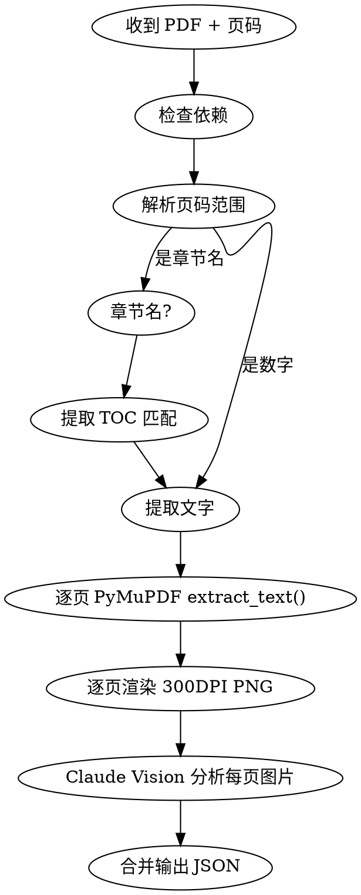

## 作用域记忆（必须）

完成本技能的入口路由并识别对象后，在首次业务查询前调用：

```text
memory_context(
  contract_version=2,
  scopes=[{type: "skill", key: "read-pdf"}, <已明确的 project/repository/tool/file scopes>],
  include_global=false,
  include_related_files=true
)
```

未知作用域不要传入；空作用域不得扩大为全量读取。全局规则已由 bootstrap 注入，不要重复请求。
> [!config]
> 本技能中的路径引用使用逻辑名（如 `{资源目录}`）。
> Orchestrator 从 `lifeos.yaml` 解析实际路径后注入上下文。
> 路径映射：
> - `{资源目录}` → directories.resources
> - `{书籍子目录}` → subdirectories.resources.books
> - `{文献子目录}` → subdirectories.resources.literature
> - `{系统目录}` → directories.system
> - `{规范子目录}` → subdirectories.system.schema

你是 LifeOS 的 PDF 解析工具，将 PDF 页面转化为结构化的 JSON 中间数据。你通过文字提取和 Vision 图像分析相结合，确保图表、公式和表格都被准确捕获，供下游技能消费。

**语言规则**：所有回复和生成内容必须为中文（JSON 字段名除外）。

**调用方式**：可由用户直接调用，也可被其他技能（`/knowledge`、`/ask` 等）内部调用。被这些技能调用时，只需返回 JSON 中间成果供，作为这些技能的数据源，不需要用户再手动串联。

# 依赖

首次使用前确认依赖已安装：

```bash
# PyMuPDF（文字提取 + 页面渲染）
pip install PyMuPDF Pillow
```

通过 `execute_command` 解析 Python 3 运行时：优先使用初始化阶段已记录的解释器；否则依次尝试
`python3` 与 Windows 的 `py -3`。只有 Python 2 或无法解析时，明确失败并提示用户安装 Python 3；
不得把 `python` 当作唯一命令。

## 脚本入口

优先调用本地脚本完成 PDF 的页码/章节定位、文字提取、页面渲染：

```bash
<已解析的 Python 3 解释器> .agents/skills/read-pdf/scripts/read_pdf.py <PDF路径> <页码范围或章节名>
```

示例：

```bash
<已解析的 Python 3 解释器> .agents/skills/read-pdf/scripts/read_pdf.py {资源目录}/{书籍子目录}/VGT/vgt.pdf 245-260
<已解析的 Python 3 解释器> .agents/skills/read-pdf/scripts/read_pdf.py {资源目录}/{书籍子目录}/VGT/vgt.pdf "第3章"
<已解析的 Python 3 解释器> .agents/skills/read-pdf/scripts/read_pdf.py {资源目录}/{书籍子目录}/VGT/vgt.pdf --list-toc
```

脚本职责：

- 只处理命中的页，不加载整本 PDF 到下游上下文
- 输出符合 `PDF_Extraction_Schema.json` 的版本化提取包；不得消费已废弃的
  `full_text`、`text_layer_missing_pages` 等扁平字段
- 默认输出名含微秒和源文件 SHA-256 前八位；只保留由输出包引用的渲染目录，失败时清理未保留临时图像
- 图表、公式、表格的视觉分析必须基于 `blocks` 与 `rendered_images` 回填，而不是猜测文字层缺失内容

## 版本化提取包（必须）

读取 JSON 后，以 `pages[*].pdf_page_index` 作为从 1 开始的物理 PDF 页序；
`printed_page_label` 为 `null` 时表示未知，禁止从物理页序推断书本印刷页码。
`requested_pages` 是唯一、升序的精确请求页集合；`requested_range` 只是其最小/最大页的包络，
不得把包络内未列出的页当作已请求或已完成。

每页必须检查：

- `status`：`complete`、`needs_ocr`、`partial` 或 `failed`
- `coverage`、`confidence` 与机器可读的 `errors`
- 按 `order` 排序的 `blocks`；`image` block 表示尚需视觉补充的区域

仅对 `needs_ocr`、`partial` 页面，或含 `image` block 的页面调用 `inspect_image`。把 OCR、公式、表格或图表
结果追加为对应位置的 block，按 `order` 合并，并重新计算 `coverage`、`confidence`、`status` 与 `errors`。
视觉补充没有完成前，页面不得宣称 `complete`。

# 输入协议

## 必须参数

| 参数 | 格式 | 示例 |
|------|------|------|
| PDF 路径 | Vault 内相对路径或绝对路径 | `{资源目录}/{书籍子目录}/VGT/vgt.pdf`；论文可用 `{资源目录}/{文献子目录}/<文件>.pdf` |
| 页码范围 | 页码、范围、或章节名 | `245-260`、`Chapter 5`、`第3章` |

## 页码解析规则

- **数字范围**：`245-260` → 直接使用（PDF 页码，从 1 开始）
- **单页**：`245` → 仅该页
- **章节名**：`Chapter 5` / `第3章` → 先用 PyMuPDF 提取 TOC（`doc.get_toc()`），匹配章节标题，确定起止页码
- **未找到章节**：输出 TOC 列表供用户选择，不猜测

# 处理流程


```dot
digraph read_pdf {
    rankdir=TB;
    "收到 PDF + 页码" -> "检查依赖";
    "检查依赖" -> "解析页码范围";
    "解析页码范围" -> "章节名?" [label="是章节名"];
    "解析页码范围" -> "提取文字" [label="是数字"];
    "章节名?" -> "提取 TOC 匹配" -> "提取文字";
    "提取文字" -> "逐页 PyMuPDF extract_text()";
    "逐页 PyMuPDF extract_text()" -> "逐页渲染 300DPI PNG";
    "逐页渲染 300DPI PNG" -> "Claude Vision 分析每页图片";
    "Claude Vision 分析每页图片" -> "合并输出 JSON";
}
```

## 步骤一：读取提取包

```python
package = json.load(open(output_path, encoding="utf-8"))
for page in package["pages"]:
    print(page["pdf_page_index"], page["printed_page_label"], page["status"])
```

- 保留物理页序与印刷页码的双字段；印刷页码未知时保持 `null`
- 对于 300+ 页大 PDF，**只处理指定范围**，不加载全文

## 步骤二：按需视觉补充

```python
for page in package["pages"]:
    if page["status"] in {"needs_ocr", "partial"} or any(block["kind"] == "image" for block in page["blocks"]):
        inspect_image(page)
```

## 步骤三：合并视觉结果

对命中的 PNG 使用 `inspect_image`，然后按 block 顺序合并：

1. **图表（charts）**：识别图表类型、描述数据趋势和关键发现
2. **公式（formulas）**：转写为 LaTeX 格式，保留原书符号约定
3. **表格（tables）**：转为 Markdown 表格格式

**关键**：公式必须忠实于原书符号，不用外部约定替换。

## 步骤四：组装与复核 JSON 输出

将所有提取结果合并为结构化 JSON，写入临时文件：

```jsonc
{
  "schema_version": 1,
  "requested_pages": [245],
  "pages": [{"pdf_page_index": 245, "printed_page_label": null, "status": "complete", "blocks": []}],
  "summary": {"complete_pages": 1, "needs_ocr_pages": 0, "partial_pages": 0, "failed_pages": 0}
}
```

输出路径：`/tmp/read-pdf-<timestamp>.json`

# 输出规范

- JSON 文件路径告知用户，供下游技能读取
- 同时在对话中给出**摘要**：完整、待 OCR、部分和失败页数
- 若视觉补充尚未完成，保留对应页的 `partial` 或 `needs_ocr`，不伪造公式、图表或表格
- **不做知识整理**——这是中间产物，整理交给 `/knowledge`, `/ask`,`/revise`等技能

# 常见问题

| 问题 | 处理 |
|------|------|
| PDF 加密/受保护 | 提示用户先解密 |
| 扫描版 PDF（无文字层） | 输出 `needs_ocr` 与 `TEXT_LAYER_MISSING`，再对该页调用 `inspect_image` |
| 页码超出范围 | 提示 PDF 总页数，让用户修正 |
| 章节名匹配失败 | 输出 TOC 供选择 |
| 单次范围过大（>50页） | 建议分批处理，每批 20-30 页 |

# 记忆系统集成

> read-pdf 作为工具技能，通常被其他技能内部调用，不需要完整的记忆集成。
> 通用协议（文件变更通知、行为约束写入）见 `_shared/memory-protocol.md`。
